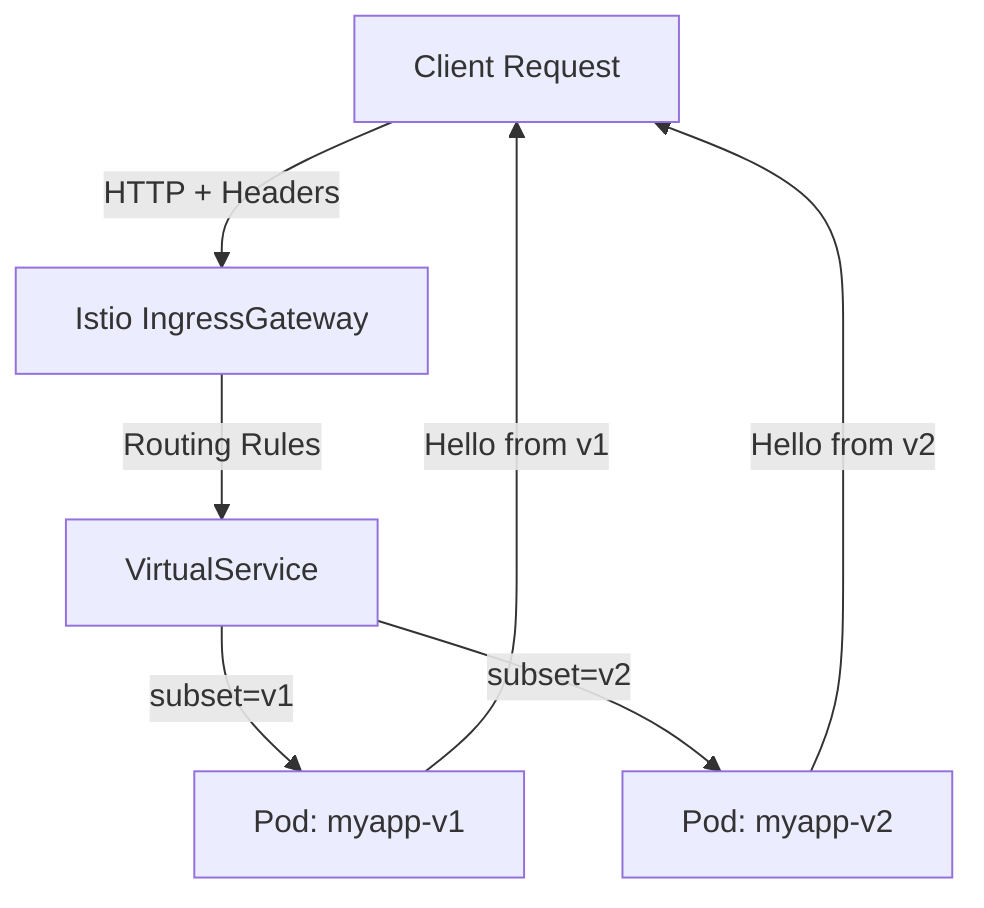

# Header Based Routing PoC
This project demonstrates how to use [Istio Service Mesh](https://www.solo.io/topics/istio/istio-architecture)
 to implement header-based routing of traffic to different versions of services running in the same Kubernetes namespace.

## 🚀 Getting Started (Local Setup)
### 1. Install prerequisites
   * [kubectl](https://kubernetes.io/docs/tasks/tools/)
   * [minikube](https://minikube.sigs.k8s.io/docs/start/?arch=%2Fmacos%2Farm64%2Fstable%2Fbinary+download)
   * [istioctl](https://istio.io/latest/docs/ops/diagnostic-tools/istioctl/)

> [!TIP]
> Add `alias k=kubectl` on a new line in `~/.bash_profile` to use `k` in place of `kubectl` in your CLI prompts.

### 2. Deploy Kubernetes resources

From the `/templates` directory:
```bash
# Create namespace
kubectl apply -f k8s/namespace.yaml

# Deploy services and deployments
kubectl apply -f k8s/.
```

At this point, you should see **two pods** running in the `istio-test` namespace.

To see pods in the `istio-test` namespace:
```bash
kubectl -n istio-test get pods
```

Response:
```
NAME                       READY   STATUS    RESTARTS      AGE
myapp-v1-abcdefghi-jklmn   2/2     Running   1 (19h ago)   23h
myapp-v2-abcdefghi-jklmn   2/2     Running   1 (19h ago)   23h
```

### 3. Configure Istio

#### 3.1. Enable Istio Sidecar Injection
Istio works by injecting an **[Envoy](https://www.envoyproxy.io/) sidecar proxy** into each pod.  
If auto-injection is not already enabled for your cluster, you’ll need to label the namespace and **restart your pods with the new config**:
```bash
kubectl label namespace istio-test istio-injection=enabled
```
> [!TIP]
> You can verify that injection is enabled by checking your namespace labels:
> 
> ```bash
> kubectl get namespace istio-test --show-labels
> ```
> You should see `istio-injection=enabled`.

#### 3.2. Apply Istio Config
Apply the Istio configuration:

```bash
kubectl apply -f istio/.
```

Istio will now:
* Inject sidecars into each pod
* Configure a VirtualService
* Expose traffic via an Ingress Gateway

## 🔍 Testing the Setup
### ⚙️ Step 1: Port-forward the Istio **Ingress Gateway*
```bash
kubectl -n istio-system port-forward service/istio-ingressgateway 8080:80
```

### 📡 Step 2: Send requests with headers
```bash
curl -H "x-version: v1" http://localhost:8080/myapp
# Response: Hello from v1

curl -H "x-version: v2" http://localhost:8080/myapp
# Response: Hello from v2
```

The `x-version` header determines which version of the service handles the request.

The header based routing is defined in [`templates/istio`](templates/istio)

The **VirtualService** config defines the routing rules (conditions + destinations)
```yaml
# virtual-service.yaml

spec:
  http:
    - match:
        - headers:
            x-version:
              exact: v1   # If header `x-version` has an exact value of `v1`
      route:
        - destination:
            host: myapp
            subset: v1    # Route traffc to a pod with label `v1`
    - match:
        - headers:
            x-version:
              exact: v2   # If header `x-version` has an exact value of `v2`
      route:
        - destination:
            host: myapp
            subset: v2    # Route traffc to a pod with label `v2`
    - route:              # Default
        - destination:
            host: myapp
            subset: v1    # Route traffc to a pod with label `v1`
```
> [!IMPORTANT]
> The `host` (`myapp`) must match the Kubernetes **Service** name in the same namespace.

And the **DestinationRule** defines the subsets of pods (v1, v2) that routing rules can point to.
```yaml
# destination-rule.yaml

spec:
  host: myapp
  subsets:
    - name: v1
      labels:
        version: v1
    - name: v2
      labels:
        version: v2
```
Together, they let Istio send requests to the right set of pods depending on the request headers.

## 📊 Architecture Overview

